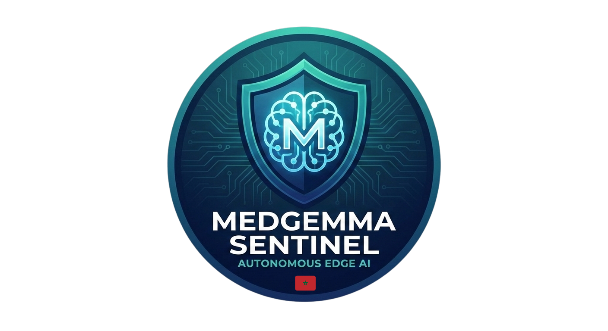
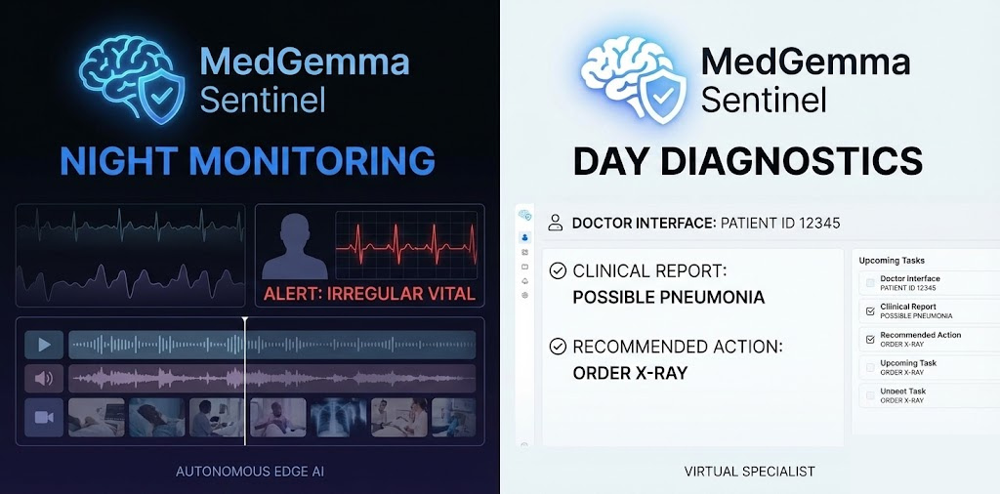

<div align="center">
  
</div>

# MedGemma Sentinel: The Autonomous Edge-AI Guardian 🏥🛡️

<div align="center">
  
</div>

**MedGemma Sentinel** is a multimodal AI agent designed for offline rural clinics (e.g., the Atlas Mountains) to bridge the "Vigilance Gap" in healthcare. It operates on low-cost hardware and switches between two specialized roles to support medical staff 24/7.

## 🌟 Key Features

* **Night Cardiology Sentinel:** Continuous vitals monitoring with windowed analysis and structured clinical summaries.
* **MCP Orchestration:** ReAct loop with tool use for cardiology analysis, patient history, and real-time context.
* **Edge-Ready Inference:** GGUF + I-Matrix quantized MedGemma for low-memory, offline deployment.
* **Longitudinal Memory:** Local patient timeline and report generation with GraphRAG.

## 🏗️ System Architecture

<div align="center">
  
</div>

MedGemma Sentinel is a **Hierarchical Agent** managed by a State Machine:

1. **Reflex Layer:** Edge sensing (vision + audio) triggers safety alerts and sends events upstream.
2. **Cognitive Layer:** MedGemma-based reasoning with ReAct tool orchestration via MCP.
3. **Memory + Reporting:** GraphRAG links daily reports, vitals trends, and generates longitudinal summaries.
4. **Clinical Delivery:** Actionable instructions and escalation criteria for the night nurse.

## 📋 Technical Stack

* **LLM:** MedGemma 2 (4B) in GGUF (I-Matrix quantized)
* **Orchestration:** MCP, ReAct loop, LangGraph
* **Memory:** LlamaIndex + GraphRAG
* **Runtime/UI:** Streamlit, llama.cpp, Ollama (local inference)
* **Vision/Audio (Reflex):** HeAR, YamNet, Faster-Whisper

## 💓 MedGemma Sentinel Apps

Four Streamlit apps are available:

- **Night Cardiology Sentinel:** Standalone vitals monitor with clinical analysis
- **MCP Cardiology Agent:** Interactive ReAct loop with tool-calling for emergency alerts
- **Longitudinal Analysis:** Compare multiple patient reports to track clinical evolution
- **Overall Report Generation:** Full Night-to-Day workflow with unified intelligence (NEW)

### Features

- **Patient Selection:** Upload patient demographics via JSON or enter manually
- **Vitals Processing:** Parse heart rate and vital signs from text files (multiple formats)
- **Windowing Analysis:** Process data in 15-minute time windows or 10-row chunks
- **Dual-Mode Dashboard:** 
  - **Night Mode:** Autonomous surveillance with real-time vitals escalation and SBAR reports
  - **Day Mode:** Doctor-assisted clinical assessment with RAP2 differential diagnosis
- **Longitudinal Analysis:** Compare multiple patient reports and track symptom/diagnosis evolution
- **Clinical Reports:** Generate professional PDF reports (SBAR, Handover, Differential)
- **Flexible Model Loading:** Use local GGUF files or download from Hugging Face

### Apps Quick Links

| App | Purpose | Run Command |
|-----|---------|-------------|
| Night Cardiology | Real-time vitals monitoring | `streamlit run app_night_cardiology_sentinal.py` |
| MCP Cardiology | ReAct agent with tools | `streamlit run app_mcp_cardiology.py` |
| Longitudinal Analysis | Multi-report evolution | `streamlit run app_longitudinal_analysis.py` |
| **Overall Report Generation** | **Night→Day full workflow (NEW)** | **`streamlit run app_overall_report_generation.py`** |

## 📚 Source Code Architecture

For detailed information about the source code modules, see [src/README.md](src/README.md). This document describes:

- **[mcp_architecture/](src/mcp_architecture/)** - Real-time ReAct-based clinical reasoning via Model Context Protocol
- **[night_cardiology_sentinel/](src/night_cardiology_sentinel/)** - Lightweight vitals processing and windowing
- **[reporting_model/](src/reporting_model/)** - Full orchestration, memory management, and report generation system
- **[longitudinal_src/](src/longitudinal_src/)** - Multi-report clinical evolution analysis and trend detection

## 🎬 Demos

Comprehensive demo videos showcasing all system capabilities are available in [demos/README.md](demos/README.md):

### Complete System Demonstrations
- **Full Night-to-Day Workflow**: [MedGemma_Sentinel_Full_Demo.mov](demos/MedGemma_Sentinel_Full_Demo.mov) — End-to-end autonomous surveillance with critical event detection and AI-powered differential diagnosis
- **MCP + Night Cardiology Sentinel**: [mcp_app.mp4](demos/mcp_app.mp4) — Standalone analyzer and MCP agent with dynamic tool selection for emergency alerts
- **Longitudinal Patient Tracking**: [MedGemma Longitudinal Analysis.mp4](demos/MedGemma%20Longitudinal%20Analysis.mp4) — Multi-report comparison and clinical trend analysis
- **Intelligent Medical Reporting**: [Demo_MedGemma_Reporting_Saâd.mp4](demos/Demo_MedGemma_Reporting_Sa%C3%A2d.mp4) — Cross-shift data synthesis with GraphRAG memory and guardrails

### Generated Clinical Reports
- **SBAR Critical Incident Report**: [RAP1_SBAR_Critical_Incident_Report.mp4](demos/reports/RAP1_SBAR_Critical_Incident_Report.mp4)
- **Shift Handover Summary**: [Shift_Handover_Report.mp4](demos/reports/Shift_Handover_Report.mp4)
- **RAP2 Differential Diagnosis**: [RAP2_Differential_Diagnosis_Report.mp4](demos/reports/RAP2_Differential_Diagnosis_Report.mp4)

### Installation

1. **Create a virtual environment:**

   ```bash
   python -m venv .venv
   ```
2. **Install dependencies:**

   ```bash
   pip install -r requirements.txt
   ```
3. **Install Ollama and pull the model:**

   ```bash
   ollama pull amsaravi/medgemma-4b-it:q6
   ```
4. **Add your Hugging Face token:**

   - Create a `.env` file in [src/mcp_architecture](src/mcp_architecture) using `.env.example` as a template.
5. **Optional (edge device): Download the model locally:**

   ```bash
   pip install -U "huggingface_hub[cli]"
   huggingface-cli download Ismailea04/medgemma-night-sentinel --local-dir ./models
   ```
6. **Optional: Install llama-cpp-python (if not already installed):**

   ```bash
   # For CPU
   pip install llama-cpp-python --extra-index-url https://abetlen.github.io/llama-cpp-python/whl/cpu

   # For CUDA (if you have NVIDIA GPU)
   pip install llama-cpp-python --extra-index-url https://abetlen.github.io/llama-cpp-python/whl/cu121
   ```

### Usage

1. **Start the app:**

   ```bash
   # Standalone analyzer
   streamlit run app_night_cardiology_sentinal.py

   # MCP cardiology agent
   streamlit run app_mcp_cardiology.py

   # Longitudinal analysis
   streamlit run app_longitudinal_analysis.py
   ```
2. **Standalone Analyzer / MCP Agent:**

   - **Step 1:** Upload `subjects_info.json` (example: `data/processed/hr_adolescent/subjects_info.json`) or enter patient details manually
   - **Step 2:** Upload vitals text file (example: `data/processed/hr_adolescent/subject_903_hr.txt`)
   - **Step 3:** Choose windowing mode (15-minute or 10-row)
   - **Step 4:** Configure model source:
     - **Local:** `models/medgemma-night-sentinel-Q4_K_M.gguf`
     - **Hugging Face:** `Ismailea04/medgemma-night-sentinel`
   - **Step 5:** Click **"🚀 Run analysis"**
3. **Longitudinal Analysis:**

   - **Step 1:** Upload 2 or more PDF reports
   - **Step 2:** Configure optional local MedGemma model (if available)
   - **Step 3:** Click **"🚀 Lancer l'Analyse"**
   - **Step 4:** View results, visualizations, and download JSON/PDF reports
4. **Overall Report Generation (NEW):**

   - **Step 1:** Select or create patient profile (demographics, MRN)
   - **Step 2 (Night Mode):** Enter/load vital signs, generate SBAR reports, trigger clinical escalations
   - **Step 3 (Day Mode):** Review clinical events, assess with doctor interface, generate RAP2 differential diagnosis
   - **Step 4:** Export comprehensive PDF reports (SBAR, Handover, Differential)
   - See [src/overall_report_generation/README.md](src/overall_report_generation/README.md) for detailed module architecture and quick start
5. **View results:**

   - Each window displays summary statistics and clinical analysis
   - Longitudinal reports show evolution trends and clinical recommendations
   - Export results as needed

### Supported Vitals Formats

**Format 1: Simple Heart Rate**

```
Time: 00:00 - heart rate [#/min]: 64
Time: 00:01 - heart rate [#/min]: 67
```

**Format 2: Multi-parameter Key-Value**

```
Time: 2s - HR: 69.92, PULSE: 68.02, RESP: 18.97, %SpO2: 97.92
Time: 4s - HR: 70.15, PULSE: 68.50, RESP: 19.02, %SpO2: 98.01
```

### Project Structure

```
medgemma-sentinel/
├── README.md                           # Main documentation (you are here)
├── src/                                # Source code modules (see src/README.md for details)
│   ├── README.md                       # 📚 Architecture overview & module guide
│   ├── mcp_architecture/               # 🧠 ReAct-based clinical reasoning
│   │   ├── README.md                   # MCP tool orchestration details
│   │   ├── medical_mcp_server.py
│   │   ├── medical_mcp_client_2.py
│   │   └── cardiology_sentinel.py
│   ├── night_cardiology_sentinel/      # 💓 Vitals monitoring & windowing
│   │   ├── README.md                   # Vitals parsing & inference details
│   │   ├── data_parser.py
│   │   └── inference.py
│   ├── reporting_model/                # 🏥 Full clinical orchestration
│   │   ├── README.md                   # Orchestration & memory system details
│   │   ├── orchestration/              # LangGraph workflow
│   │   ├── memory/                     # GraphRAG patient records
│   │   ├── reporting/                  # PDF generation
│   │   └── guardrails/                 # Safety checks
│   └── longitudinal_src/               # 📊 Multi-report evolution analysis
│       ├── README.md                   # Report extraction & evolution tracking
│       └── longitudinal_analysis.py
├── app_night_cardiology_sentinal.py    # Standalone vitals analyzer
├── app_mcp_cardiology.py               # MCP cardiology agent with ReAct
├── app_longitudinal_analysis.py        # Longitudinal report analysis
├── models/
│   └── medgemma-night-sentinel-Q4_K_M.gguf
├── data/
│   └── processed/
│       └── hr_adolescent/
│           ├── subjects_info.json
│           └── subject_*.txt
└── figures/
    ├── logo2.png
    ├── card_medgemma_sentinal.png
    └── workflow.png
```

**📖 To understand each module in detail:**

- Start with [src/README.md](src/README.md) for the big picture
- Then explore each module's README:
  - [src/mcp_architecture/README.md](src/mcp_architecture/README.md) - Tool-based reasoning
  - [src/night_cardiology_sentinel/README.md](src/night_cardiology_sentinel/README.md) - Vitals processing
  - [src/reporting_model/README.md](src/reporting_model/README.md) - Full orchestration
  - [src/longitudinal_src/README.md](src/longitudinal_src/README.md) - Report evolution

### Example Use Case

**Scenario:** Night shift monitoring of a 65-year-old male post-operative patient

1. Upload patient profile (baseline HR: 70 bpm)
2. Monitor continuous vitals stream
3. System detects: HR spike to 135 bpm, irregular rhythm, SpO2 92%
4. **Night Sentinel Report:**
   - **Comparison:** Significant deviation from baseline (65 bpm increase)
   - **Detection:** Tachycardia with arrhythmia + mild hypoxemia
   - **Interpretation:** Possible atrial fibrillation or early sepsis - requires immediate clinical assessment

## 👥 The "Special Forces" Team

* **Infrastructure:** Hamza — Model quantization and API deployment.
* **Steering:** Ismail — Activation engineering and vector injection.
* **Audio:** Youssra — Event detection and speech-to-text.
* **Vision & UI:** Saad/Othman — Fall detection and Streamlit dashboard.
* **Memory & Scribe:** Saad/Othman — LangGraph orchestration and PDF reporting.

## 🚀 Deployment

Designed for the **Kaggle MedGemma Impact Challenge**. Deadline: February 24, 2026.
